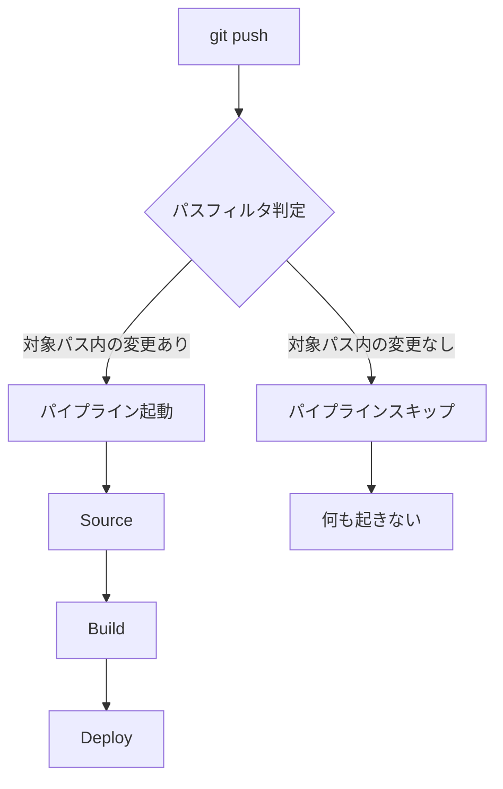

## はじめに

業務でCodePipelineのパスフィルタ機能を知りました。更新のあったファイルによってパイプラインを起動/スキップできる機能です。

モノレポ構成や複数のアプリケーションを1つのリポジトリで管理している場合、「ドキュメントを更新しただけなのにパイプラインが走ってしまう」ということがあります。パスフィルタを使えば、これを防げそうです。

以前は CodeBuild 側で変更差分をチェックして、差分がなければ `exit 0` で終了させるようなハックが必要でしたが、パスフィルタにより Pipeline の実行自体を止められるようになりました。これにより、実行履歴が汚れず、コストもかからなくなります。

実務で使えるレベルまで挙動を確認したかったので、実際に検証してみました。

### 検証したこと

- パスフィルタの基本設定方法（コンソール / CLI / CloudFormation）
- 挙動確認（対象パス内の変更 → 起動、対象外 → 起動しない）
- 複数パスの指定（OR条件）
- 除外パターンの設定

### 検証リポジトリ

https://github.com/toshiro3/codepipeline-path-filter-demo

## パスフィルタとは

パスフィルタは、CodePipeline V2 で利用できる機能で、Git の Push イベントをトリガーとする際に、変更されたファイルのパスに基づいてパイプラインの起動を制御できます。

### 挙動の概念図



パスフィルタは、CodeStar Connections（接続）がイベントを受信した段階で判定されます。条件に合致しない場合は実行（Execution）自体が生成されないため、実行履歴にも残りません。

### ユースケース

| シナリオ | 設定例 |
|----------|--------|
| アプリケーションコードの変更時のみビルド | `app/**`, `src/**` |
| ドキュメント変更ではビルドしない | `docs/**` を除外 |
| テストファイルの変更ではビルドしない | `**/*.test.js` を除外 |
| インフラコードの変更時のみデプロイ | `infra/**`, `terraform/**` |

### 前提条件

- **パイプラインタイプ**: V2（V1 では利用不可）
- **ソースプロバイダー**: CodeStar Connections（GitHub / GitLab / Bitbucket）または CodeCommit

:::message
**補足: ソースプロバイダーの制限**
- **S3 ソースは非対応**: パスフィルタは Git の Push イベントに基づくため、S3 をソースにしている場合は利用できません
:::

## 検証環境

### リポジトリ構成

```
codepipeline-path-filter-demo/
├── app/
│   ├── index.js
│   └── test/
│       └── sample.test.js
├── src/
│   └── main.js
├── docs/
│   └── README.md
└── buildspec.yml
```

### 検証シナリオ

| テストケース | 期待する動作 |
|--------------|--------------|
| `app/index.js` を変更 | パイプライン起動 |
| `docs/README.md` を変更 | パイプライン起動しない |
| `src/main.js` を変更 | パイプライン起動 |
| `app/test/sample.test.js` を変更 | パイプライン起動しない（除外設定後） |

## コンソールでの設定方法

### Step 1: パイプラインの作成

1. CodePipeline コンソールで「パイプラインを作成」をクリック
2. **Build custom pipeline** を選択（これにより自動的に V2 になる）
3. パイプライン名を入力（例: `path-filter-demo-pipeline`）
4. Execution mode は「Queued」を選択

### Step 2: ソースステージの設定

1. **Source provider**: GitHub (via GitHub App)
2. **Connection**: 事前に作成した CodeStar Connection を選択
3. **Repository name**: リポジトリを選択
4. **Default branch**: `main`

### Step 3: パスフィルタの設定

ソースステージの設定画面で「**Webhook event filters**」セクションを展開します。

:::message
**用語について**: コンソールでは「Webhook event filters」と表示されますが、CodePipeline V2 においては「トリガー（Triggers）」の「Git 構成（Git configuration）」と呼ぶのがより正確です。V1 の Webhook 方式とは異なり、V2 は CodeStar Connections を通じてイベントを直接検知する仕組みになっています。
:::


#### 基本設定

| 項目 | 設定値 |
|------|--------|
| Event type | Push |
| Filter type | Branch |
| Branches or patterns | `main` |
| File paths | `app/**` |

この設定で「main ブランチへの Push で、かつ `app/` ディレクトリ内のファイルが変更された場合のみ」パイプラインが起動します。

### Step 4: ビルドステージの設定

今回は検証用なので、シンプルな Commands アクションを使用しました。

:::message
**補足**: 検証では簡略化のため Commands アクションを使用しています。既存の CodeBuild アクションを使用している場合も、パスフィルタの設定箇所（`Triggers` セクション）は同じです。ただし、IAM 権限周りのエラー（CloudWatch Logs 等）は CodeBuild 側のロール設定に依存します。
:::

```
ls
echo "Hello World"
```

### Step 5: パイプラインの保存

テスト・デプロイステージはスキップし、パイプラインを作成しました。

## 挙動確認

### テスト 1: 対象パス内の変更 → 起動

```bash
echo 'console.log("Hello from app - updated!");' > app/index.js
git add .
git commit -m "test: update app/index.js to trigger pipeline"
git push
```

**結果**: パイプラインが起動 ✅

Executions タブで確認すると、Trigger に「Commit xxx pushed in ...」と表示され、正常にトリガーされました。

### テスト 2: 対象パス外の変更 → 起動しない

```bash
echo "# Documentation - updated" > docs/README.md
git add .
git commit -m "test: update docs - should NOT trigger pipeline"
git push
```

**結果**: パイプラインは起動せず ✅

Executions タブに新しい実行が追加されていないことを確認しました。

## 複数パスの指定（OR条件）

複数のディレクトリを対象にしたい場合は、カンマ区切りで指定します。

### 設定方法

1. パイプラインを編集
2. Edit: Git Triggers → Edit triggers
3. **File paths** を `app/**, src/**` に変更


### 検証

```bash
echo 'console.log("Hello from src!");' > src/main.js
git add .
git commit -m "test: update src/main.js to trigger pipeline"
git push
```

**結果**: パイプラインが起動 ✅

`app/**` または `src/**` のいずれかに変更があれば、パイプラインが起動することを確認しました。

## 除外パターンの設定

特定のパスを除外したい場合は、「**Don't start pipeline under these conditions**」セクションを使用します。

### ユースケース

- `app/**` の変更で起動
- ただし `app/test/**`（テストファイル）は除外

### 設定方法

1. パイプラインを編集
2. Edit: Git Triggers → Edit triggers
3. 「**Don't start pipeline under these conditions**」を展開
4. **File paths** に `app/test/**` を入力


### 重要: ブランチ指定の注意点

除外条件の「Branches or patterns」は **空欄のまま** にする必要がありました。

:::message alert
**ハマりポイント**: 除外条件の「Branches or patterns」に Include と同じブランチ（例: `main`）を指定すると、そのブランチ全体が除外されてしまいます。除外条件では File paths のみを指定し、ブランチは空欄にする必要があります。
:::

実際、除外条件に `main` ブランチを指定したところ、`app/index.js` の変更でもパイプラインが起動しなくなりました。ブランチ指定を削除することで正常に動作するようになりました。

### 検証

#### テスト 1: 除外対象のファイルを変更

```bash
echo 'console.log("test file - updated");' > app/test/sample.test.js
git add .
git commit -m "test: update app/test - should NOT trigger pipeline"
git push
```

**結果**: パイプラインは起動せず ✅

#### テスト 2: 除外対象外のファイルを変更

```bash
echo 'console.log("Hello from app!");' > app/index.js
git add .
git commit -m "test: update app/index.js - should trigger pipeline"
git push
```

**結果**: パイプラインが起動 ✅

## CLI での設定方法

CLIでもパスフィルタを設定・更新できるか検証しました。

### パイプライン設定の取得

```bash
aws codepipeline get-pipeline \
  --name path-filter-demo-pipeline \
  --query 'pipeline' > pipeline.json
```

### パスフィルタの構造

取得した `pipeline.json` の `triggers` セクションを確認しました。

```json
{
  "triggers": [
    {
      "providerType": "CodeStarSourceConnection",
      "gitConfiguration": {
        "sourceActionName": "Source",
        "push": [
          {
            "branches": {
              "includes": ["main"]
            },
            "filePaths": {
              "includes": ["app/**", "src/**"],
              "excludes": ["app/test/**"]
            }
          }
        ]
      }
    }
  ]
}
```

### パスフィルタの更新

`pipeline.json` を編集し、`filePaths.includes` に `infra/**` を追加してみました。

```json
"includes": ["app/**", "src/**", "infra/**"]
```

### 更新の適用

```bash
# pipeline キーでラップ
jq '{pipeline: .}' pipeline.json > pipeline-update.json

# 更新実行
aws codepipeline update-pipeline --cli-input-json file://pipeline-update.json
```

**結果**: コンソールで確認すると、`infra/**` が追加されていました ✅

## CloudFormation での設定方法

IaC でパイプラインを管理することを想定し、CloudFormation でも検証しました。

### テンプレート

```yaml
AWSTemplateFormatVersion: '2010-09-09'
Description: CodePipeline with Path Filter

Parameters:
  ConnectionArn:
    Type: String
    Description: CodeStar Connection ARN
  RepositoryId:
    Type: String
    Description: GitHub repository (e.g., your-org/your-repo)

Resources:
  PipelineRole:
    Type: AWS::IAM::Role
    Properties:
      RoleName: cfn-path-filter-pipeline-role
      AssumeRolePolicyDocument:
        Version: '2012-10-17'
        Statement:
          - Effect: Allow
            Principal:
              Service: codepipeline.amazonaws.com
            Action: sts:AssumeRole
      Policies:
        - PolicyName: CodePipelineAccess
          PolicyDocument:
            Version: '2012-10-17'
            Statement:
              - Effect: Allow
                Action:
                  - codeconnections:UseConnection
                  - codestar-connections:UseConnection
                Resource: !Ref ConnectionArn
              - Effect: Allow
                Action:
                  - s3:*
                Resource: '*'
              - Effect: Allow
                Action:
                  - logs:CreateLogGroup
                  - logs:CreateLogStream
                  - logs:PutLogEvents
                Resource: '*'

  ArtifactBucket:
    Type: AWS::S3::Bucket

  Pipeline:
    Type: AWS::CodePipeline::Pipeline
    Properties:
      Name: cfn-path-filter-demo-pipeline
      PipelineType: V2
      ExecutionMode: QUEUED
      RoleArn: !GetAtt PipelineRole.Arn
      ArtifactStore:
        Type: S3
        Location: !Ref ArtifactBucket
      
      # パスフィルタの設定
      Triggers:
        - ProviderType: CodeStarSourceConnection
          GitConfiguration:
            SourceActionName: Source
            Push:
              - Branches:
                  Includes:
                    - main
                FilePaths:
                  Includes:
                    - 'app/**'
                    - 'src/**'
                  Excludes:
                    - 'app/test/**'
      
      Stages:
        - Name: Source
          Actions:
            - Name: Source
              ActionTypeId:
                Category: Source
                Owner: AWS
                Provider: CodeStarSourceConnection
                Version: '1'
              Configuration:
                ConnectionArn: !Ref ConnectionArn
                FullRepositoryId: !Ref RepositoryId
                BranchName: main
                DetectChanges: 'true'
              OutputArtifacts:
                - Name: SourceArtifact
        
        - Name: Build
          Actions:
            - Name: Build
              ActionTypeId:
                Category: Compute
                Owner: AWS
                Provider: Commands
                Version: '1'
              Configuration: {}
              InputArtifacts:
                - Name: SourceArtifact
              Commands:
                - echo "Build from CloudFormation"
                - ls -la
```

### ポイント

1. **PipelineType**: `V2` を指定（パスフィルタは V2 のみ対応）
2. **Triggers**: `GitConfiguration` 内で `Push` のフィルタを定義
3. **FilePaths**: `Includes` と `Excludes` を配列で指定
4. **RepositoryId**: パラメータ化して再利用しやすくする

### デプロイ

```bash
aws cloudformation create-stack \
  --stack-name path-filter-demo-cfn \
  --template-body file://pipeline-cfn.yaml \
  --parameters \
    ParameterKey=ConnectionArn,ParameterValue=arn:aws:codeconnections:ap-northeast-1:123456789012:connection/xxxxx \
    ParameterKey=RepositoryId,ParameterValue=your-org/your-repo \
  --capabilities CAPABILITY_NAMED_IAM
```

**結果**: パイプラインが作成され、パスフィルタも正しく設定されていました ✅

## ハマりポイントまとめ

検証中にいくつかハマったポイントがあったので、まとめておきます。

### 1. パイプラインタイプは V2 のみ対応

パスフィルタは **CodePipeline V2** でのみ利用可能です。既存の V1 パイプラインで使用したい場合は、V2 に移行する必要があります。

コンソールで「Build custom pipeline」を選択すると自動的に V2 になりますが、CLI や CloudFormation で作成する場合は明示的に `PipelineType: V2` を指定してください。

### 2. 除外条件のブランチ指定に注意

:::message alert
除外条件（Don't start pipeline under these conditions）の「Branches or patterns」に Include と同じブランチを指定すると、意図せずそのブランチ全体が除外されてしまいます。

**解決策**: 除外条件では File paths のみを指定し、Branches or patterns は空欄にする。
:::

### 3. 複数フィルタは OR 条件

Filters に複数のフィルタを追加すると、**OR 条件**で評価されます。

複数のフィルタリスト（Push 配列内の要素）を定義した場合、いずれか一つのフィルタに合致すればパイプラインが実行されます。そのため、意図しない「全通しフィルタ」が残っていないか注意が必要です。

たとえば、以下の2つのフィルタがある場合:
- Filter 1: `main` ブランチ + パスフィルタなし
- Filter 2: `main` ブランチ + `app/**`

Filter 1 が全ての変更にマッチするため、パスフィルタが効きません。不要なフィルタは削除してください。

### 4. Commands アクションには CloudWatch Logs 権限が必要

CloudFormation で Commands アクションを使用する場合、IAM ロールに CloudWatch Logs の権限が必要です。

```yaml
- Effect: Allow
  Action:
    - logs:CreateLogGroup
    - logs:CreateLogStream
    - logs:PutLogEvents
  Resource: '*'
```

この権限がないと、以下のエラーが発生しました:

> Action failed with status: FAILED. Service role does not have permissions to create Amazon CloudWatch log streams.

### 5. グロブパターンの書き方

| パターン | 意味 |
|----------|------|
| `app/**` | app ディレクトリ以下の全ファイル |
| `*.js` | ルートディレクトリの .js ファイル |
| `**/*.js` | 全ディレクトリの .js ファイル |
| `app/*.js` | app ディレクトリ直下の .js ファイル |

### 6. DetectChanges と Triggers の関係

CloudFormation でソースアクションに `DetectChanges: 'true'` を設定していても、V2 では `Triggers` セクションの定義が優先されます。パスフィルタを効かせたい場合は、必ず `Triggers` 側でフィルタを定義してください。

従来の `DetectChanges`（ポーリングや古い Webhook）よりも、`Triggers` セクションでのイベント管理が推奨されています。

## 検証結果まとめ

| 設定方法 | 検証結果 |
|----------|----------|
| コンソール | ✅ 成功 |
| CLI | ✅ 成功 |
| CloudFormation | ✅ 成功 |

| テストケース | 期待動作 | 結果 |
|--------------|----------|------|
| `app/` 変更 | 起動 | ✅ |
| `docs/` 変更 | 起動しない | ✅ |
| `src/` 変更（複数パス） | 起動 | ✅ |
| `app/test/` 変更（除外） | 起動しない | ✅ |
| `app/index.js` 変更（除外対象外） | 起動 | ✅ |

## まとめ

CodePipeline のパスフィルタ機能を検証しました。

設定自体は簡単で、期待通りの挙動をすることが確認できました。ただし、除外条件のブランチ指定など、いくつかハマりポイントがあったので、導入時は注意が必要です。

パスフィルタを使うことで、以下のメリットが得られそうです:

- **コスト削減**: 不要な CodePipeline の実行（V2 はアクション実行時間課金）と、それに続く CodeBuild の実行コストをカット
- **実行履歴の整理**: 「本当に必要な変更」のみに絞られるため、デバッグが容易になる
- **モノレポ対応**: アプリケーションごとにパイプラインを起動可能

---

次回は **CodePipeline + Slack 通知** を検証予定です。
