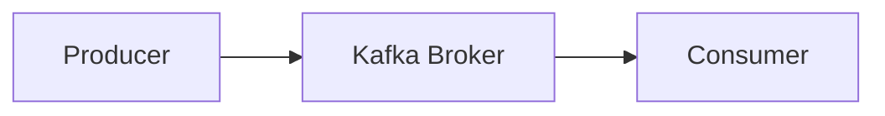
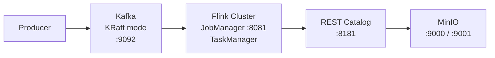

## はじめに

前回の記事では、Flink SQLでIcebergテーブルを操作する基本を紹介しました。

https://zenn.dev/toshiro3/articles/flink-iceberg-intro

今回は、Flinkの本領である**ストリーミング処理**を体験します。KafkaからリアルタイムでデータをIcebergに書き込み、ウィンドウ集計も行います。

### この記事で扱う内容

- Kafkaの基本概念（KRaftモード）
- KafkaからIcebergへのストリーミング書き込み
- ウィンドウ集計（1分ごとのイベント集計）
- ウォーターマークとウィンドウの確定タイミング
- コマンドラインでのジョブ管理

## Apache Kafkaとは

Apache Kafkaは、大量のデータをリアルタイムで収集・配信するための分散メッセージングシステムです。



### コンポーネントの役割

| コンポーネント | 役割 |
|---------------|------|
| **Broker** | メッセージの保存・配信を行う本体 |
| **Topic** | メッセージのカテゴリ |
| **Partition** | Topicを分割した単位（並列処理用） |
| **Controller** | クラスタのメタデータ管理（KRaftモードではBrokerが兼任） |

:::message
Kafka 4.0以降では、従来のZookeeperに代わり**KRaft（Kafka Raft）モード**が標準となりました。KRaftモードでは、Brokerがコントローラーの役割も担うため、Zookeeperが不要になり、運用がシンプルになります。
:::

## アーキテクチャ



## 環境構築

本記事で使用する環境はGitHubリポジトリで公開しています。

https://github.com/toshiro3/flink-kafka-iceberg-lab

```bash
git clone https://github.com/toshiro3/flink-kafka-iceberg-lab.git
cd flink-kafka-iceberg-lab
docker compose up -d
```

初回起動時はDockerイメージのビルドに数分かかります。

### サービスの確認

| サービス | URL | 用途 |
|---------|-----|------|
| Flink Web UI | http://localhost:8081 | ジョブ監視 |
| MinIO Console | http://localhost:9001 | ストレージ管理（admin/password） |

:::message alert
TaskManagerが起動していない場合があります。Flink Web UIの「Task Managers」タブで確認し、表示されていなければ以下を実行してください。

```bash
docker compose up -d taskmanager
```
:::

## ターミナルの役割

この記事では3つのターミナルを使用します。

| ターミナル | 役割 | 用途 |
|-----------|------|------|
| **ターミナル1** | Kafkaプロデューサー | メッセージ送信 |
| **ターミナル2** | Flink SQL Client（ジョブ実行） | ストリーミングジョブを実行 |
| **ターミナル3** | Flink SQL Client（確認用） | Icebergテーブルのデータ確認 |

## カタログの使い分け

Flink SQL Clientでは2つのカタログを使い分けます。

| カタログ | 種類 | 永続化 | 用途 |
|---------|------|--------|------|
| default_catalog | インメモリ | ❌ | Kafkaなどのコネクタテーブル |
| iceberg_catalog | REST Catalog | ✅ | Icebergテーブル（データレイク） |

**なぜ分けるのか？**

- KafkaテーブルはWATERMARK定義が必要だが、IcebergカタログはWATERMARK付きテーブルをサポートしていない
- Kafkaテーブルは「接続定義」、Icebergテーブルは「データの保存先」という役割の違い

## 基本のストリーミング書き込み

### ターミナル2: Flink SQL Clientを起動

```bash
docker compose run --rm sql-client
```

起動時にIcebergカタログが自動登録されます。

### Kafkaソーステーブルの作成

```sql
-- default_catalogにKafkaテーブルを作成
USE CATALOG default_catalog;
USE default_database;

CREATE TABLE kafka_events (
    event_id STRING,
    user_id STRING,
    event_type STRING,
    event_time TIMESTAMP(3),
    WATERMARK FOR event_time AS event_time - INTERVAL '5' SECOND
) WITH (
    'connector' = 'kafka',
    'topic' = 'events',
    'properties.bootstrap.servers' = 'kafka:29092',
    'properties.group.id' = 'flink-consumer',
    'scan.startup.mode' = 'earliest-offset',
    'format' = 'json',
    'json.timestamp-format.standard' = 'ISO-8601'
);
```

### Iceberg書き込み先テーブルの作成

```sql
USE CATALOG iceberg_catalog;

-- データベースを作成
CREATE DATABASE IF NOT EXISTS demo;
USE demo;

CREATE TABLE events (
    event_id STRING,
    user_id STRING,
    event_type STRING,
    event_time TIMESTAMP(6)
);
```

### ターミナル1: Kafkaにテストデータを送信

```bash
docker compose exec kafka /opt/kafka/bin/kafka-console-producer.sh \
  --bootstrap-server localhost:9092 \
  --topic events
```

以下のJSONを1行ずつ入力：

```json
{"event_id":"e001","user_id":"u001","event_type":"click","event_time":"2025-12-29T10:00:00"}
{"event_id":"e002","user_id":"u002","event_type":"view","event_time":"2025-12-29T10:00:05"}
{"event_id":"e003","user_id":"u001","event_type":"purchase","event_time":"2025-12-29T10:00:10"}
```

`Ctrl+C`で終了。

### ターミナル2: ストリーミングジョブを実行

```sql
SET 'execution.runtime-mode' = 'streaming';
SET 'execution.checkpointing.interval' = '10s';

INSERT INTO iceberg_catalog.demo.events
SELECT 
    event_id,
    user_id,
    event_type,
    event_time
FROM default_catalog.default_database.kafka_events;
```

:::message
`execution.checkpointing.interval`は重要な設定です。Icebergへの書き込みはチェックポイント完了時にコミットされるため、この設定がないとデータが書き込まれません。
:::

### ターミナル3: データを確認

```bash
docker compose run --rm sql-client
```

```sql
USE CATALOG iceberg_catalog;
USE demo;

SET 'execution.runtime-mode' = 'batch';
SELECT * FROM events;
```

3件のデータが表示されれば成功です。

### リアルタイム書き込みの確認

ターミナル1で追加データを送信：

```json
{"event_id":"e004","user_id":"u003","event_type":"login","event_time":"2025-12-29T10:01:00"}
```

10秒程度待ってから、ターミナル3で再度確認すると4件に増えています。

## ウィンドウ集計

Flinkの強力な機能の1つが**ウィンドウ集計**です。一定時間ごとにデータを集計できます。

:::message
**Kafkaの重要な特徴**

Kafkaでは、コンシューマーがメッセージを読み取っても**メッセージは削除されません**。従来のメッセージキューとは異なり、保持期間（デフォルト7日）までメッセージは保持され、複数のコンシューマーが同じデータを読み取ることができます。

そのため、ウィンドウ集計で同じトピック（`events`）を使うと、基本のストリーミング書き込みで送信したデータも再度読み取られます。ここでは別のトピック（`window-events`）を使用します。
:::

### 集計結果テーブルの作成

ターミナル3で：

```sql
USE CATALOG iceberg_catalog;
USE demo;

CREATE TABLE event_counts (
    window_start TIMESTAMP(6),
    window_end TIMESTAMP(6),
    event_type STRING,
    event_count BIGINT
);
```

### ターミナル2: 新しいFlink SQL Clientを起動

現在のジョブをキャンセルするか、別のターミナルでFlink SQL Clientを起動します。

```bash
docker compose run --rm sql-client
```

### Kafkaテーブルを作成（ウィンドウ集計用）

```sql
USE CATALOG default_catalog;
USE default_database;

CREATE TABLE kafka_window_events (
    event_id STRING,
    user_id STRING,
    event_type STRING,
    event_time TIMESTAMP(3),
    WATERMARK FOR event_time AS event_time - INTERVAL '5' SECOND
) WITH (
    'connector' = 'kafka',
    'topic' = 'window-events',
    'properties.bootstrap.servers' = 'kafka:29092',
    'properties.group.id' = 'flink-consumer-window',
    'scan.startup.mode' = 'earliest-offset',
    'format' = 'json',
    'json.timestamp-format.standard' = 'ISO-8601'
);
```

### ウィンドウ集計ジョブを実行

```sql
SET 'execution.runtime-mode' = 'streaming';
SET 'execution.checkpointing.interval' = '10s';

INSERT INTO iceberg_catalog.demo.event_counts
SELECT 
    window_start,
    window_end,
    event_type,
    COUNT(*) as event_count
FROM TABLE(
    TUMBLE(TABLE kafka_window_events, DESCRIPTOR(event_time), INTERVAL '1' MINUTE)
)
GROUP BY window_start, window_end, event_type;
```

`TUMBLE`は**タンブリングウィンドウ**で、重複のない固定サイズのウィンドウを作成します。この例では1分ごとに集計します。

### ターミナル1: テストデータを送信

別のトピック（`window-events`）にデータを送信します。

```bash
docker compose exec kafka /opt/kafka/bin/kafka-console-producer.sh \
  --bootstrap-server localhost:9092 \
  --topic window-events
```

```json
{"event_id":"w001","user_id":"u001","event_type":"click","event_time":"2025-12-29T10:00:10"}
{"event_id":"w002","user_id":"u002","event_type":"click","event_time":"2025-12-29T10:00:20"}
{"event_id":"w003","user_id":"u001","event_type":"view","event_time":"2025-12-29T10:00:30"}
{"event_id":"w004","user_id":"u003","event_type":"click","event_time":"2025-12-29T10:00:45"}
{"event_id":"w005","user_id":"u002","event_type":"purchase","event_time":"2025-12-29T10:00:55"}
```

### ターミナル3: この時点での集計結果を確認

10秒以上待ってから、集計結果を確認します。

```sql
SELECT * FROM iceberg_catalog.demo.event_counts ORDER BY window_start, event_type;
```

**結果は空（0件）です。** 5件すべてが10:00〜10:01のウィンドウに属していますが、まだウィンドウは確定していません。

### ターミナル1: ウィンドウを確定させる

ウィンドウ集計では、**次のウィンドウのデータが来るまでウィンドウは確定しません**。次のウィンドウ（10:01〜10:02）のデータを送信します。

```json
{"event_id":"w006","user_id":"u001","event_type":"click","event_time":"2025-12-29T10:01:10"}
```

### ターミナル3: 集計結果を確認

10秒以上待ってから、再度確認します。

```sql
SELECT * FROM iceberg_catalog.demo.event_counts ORDER BY window_start, event_type;
```

```
+-------------------------+-------------------------+------------+-------------+
|            window_start |              window_end | event_type | event_count |
+-------------------------+-------------------------+------------+-------------+
| 2025-12-29 10:00:00.000 | 2025-12-29 10:01:00.000 |      click |           3 |
| 2025-12-29 10:00:00.000 | 2025-12-29 10:01:00.000 |   purchase |           1 |
| 2025-12-29 10:00:00.000 | 2025-12-29 10:01:00.000 |       view |           1 |
+-------------------------+-------------------------+------------+-------------+
```

10:00〜10:01のウィンドウで、event_type別の集計結果が出力されました。

## ウォーターマークとウィンドウの確定

### ウォーターマークとは

ウォーターマークは「ここまでのイベント時刻のデータは到着済み」という目印です。

```sql
WATERMARK FOR event_time AS event_time - INTERVAL '5' SECOND
```

この設定では、イベント時刻から5秒引いた時刻がウォーターマークになります。これにより、最大5秒の遅延データを許容します。

### ウィンドウが確定するタイミング

```
イベント時刻の流れ
────────────────────────────────────────────────────────►

10:00:10  10:00:55  10:01:10
   │         │         │
   ▼         ▼         ▼
┌─────────────────┐
│  10:00〜10:01   │  ← 10:01以降のデータが来た時点で確定
│  click: 3      │
│  purchase: 1   │
│  view: 1       │
└─────────────────┘
```

**重要:** 次のウィンドウのデータが来るまで、現在のウィンドウは確定しません。実運用では継続的にイベントが流れるため、通常は問題になりません。

## メタデータテーブルの確認

Icebergのスナップショットを確認できます。

```sql
SELECT snapshot_id, committed_at, operation 
FROM iceberg_catalog.demo.`event_counts$snapshots`
ORDER BY committed_at;
```

チェックポイントごとにスナップショットが作成されていることが確認できます。

## コマンドラインでのジョブ管理

Flink Web UI以外にも、コマンドラインでジョブを管理できます。

### ジョブ一覧の確認

```bash
docker compose exec jobmanager flink list
```

### ジョブのキャンセル

```bash
docker compose exec jobmanager flink cancel <job_id>
```

### ジョブの停止（Savepoint付き）

```bash
docker compose exec jobmanager flink stop <job_id>
```

`stop`はSavepointを作成して停止するため、後で同じ状態から再開できます。

## まとめ

### 確認できたこと

| 項目 | 状態 |
|------|------|
| Kafka + Flink + Iceberg環境構築 | ✅ |
| KafkaからIcebergへのストリーミング書き込み | ✅ |
| リアルタイム連携 | ✅ |
| ウィンドウ集計（TUMBLE） | ✅ |
| ウォーターマークによるウィンドウ確定 | ✅ |
| メタデータテーブル確認 | ✅ |
| コマンドラインでのジョブ管理 | ✅ |

### 今回の記事では扱わなかったこと

- 複数パーティションでの並列処理
- アイドルタイムアウトの設定と制限
- Savepointからのジョブ再開
- スライディングウィンドウやセッションウィンドウ

これらについては、別の記事で扱えればと思います。

## 参考資料

- [Apache Flink公式](https://flink.apache.org/)
- [Flink Kafka Connector](https://nightlies.apache.org/flink/flink-docs-release-1.18/docs/connectors/table/kafka/)
- [Flink Iceberg Connector](https://iceberg.apache.org/docs/latest/flink/)
- [Apache Kafka公式](https://kafka.apache.org/)
